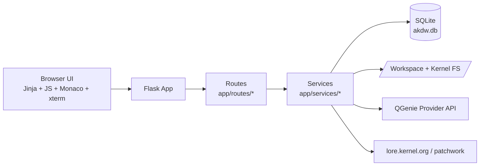
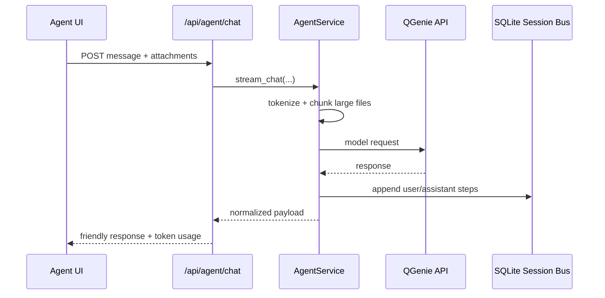
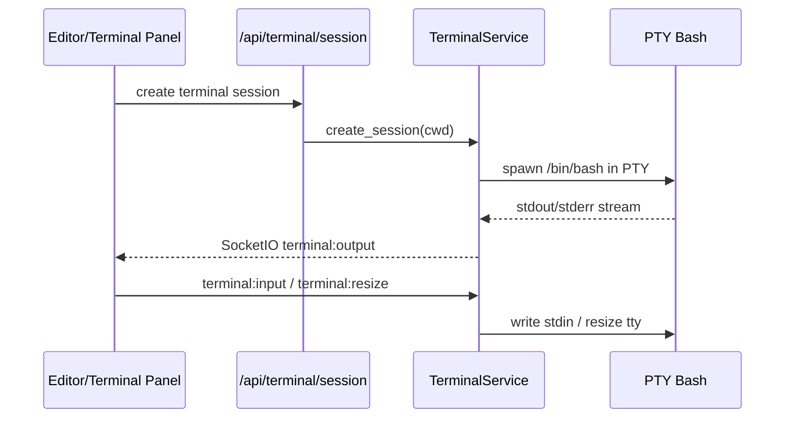

# AKDW Architecture

## High-Level View



## Module Map

```mermaid
flowchart TD
  D[Dashboard] --> A[QGenie Agent]
  D --> E[Code Editor]
  D --> P[Patch Workshop]
  D --> U[Upstream Tracker]
  D --> T[Triage]
  D --> M[Target Manager]

  E --> API1[/api/editor/file]
  E --> API2[/api/terminal/*]
  A --> API3[/api/agent/chat + stream]
  P --> API4[/api/patchwise/*]
  U --> API5[/api/upstream/*]
  M --> API6[/target-manager/api/*]
```

## Agent Request Lifecycle



## Terminal-IDE Flow



## Data Model (Core)

- `Session` / `Message`: shared session bus for Agent/Editor history and replay.
- `UpstreamPatch`: external patch tracking and dashboard patch health.
- `Target` / `ValidationRun`: target registration, validation output, replayable history.
- `ActivityLog`: dashboard recent activity and operational traceability.

## Security and Guardrails

- Filesystem path access is constrained via `safe_path()` allowed roots.
- Terminal command filtering blocks destructive commands (`rm -rf /`, `shutdown`, `reboot`).
- Agent token guard chunks oversized attachments before model calls.
- TLS verification/CA bundle handling is configurable for enterprise endpoints.

## Known Integration Points

- QGenie provider URL and model config from environment/settings.
- lore/patchwork metadata fetch paths in Upstream Tracker.
- Optional ADB/Fastboot integration in Target Manager depending on runtime availability.
