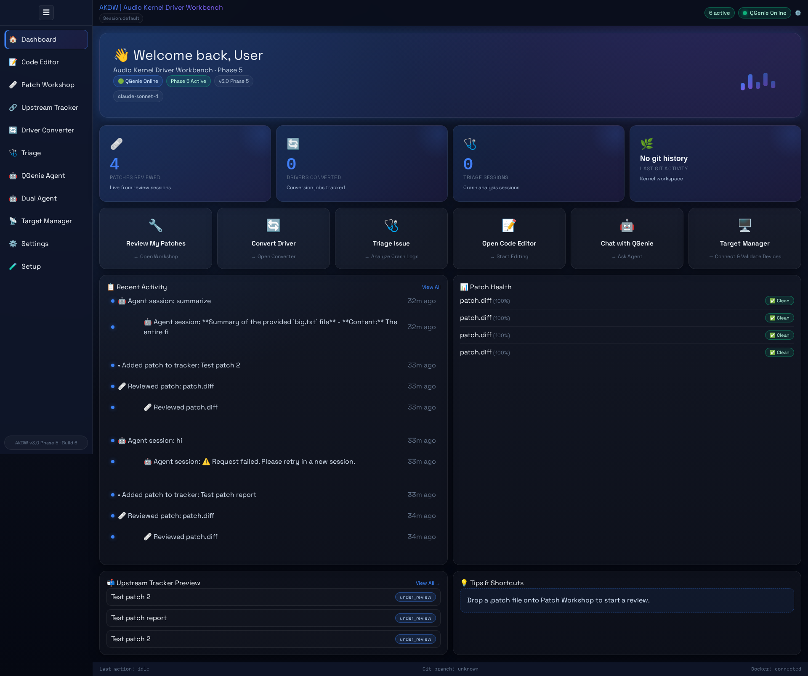
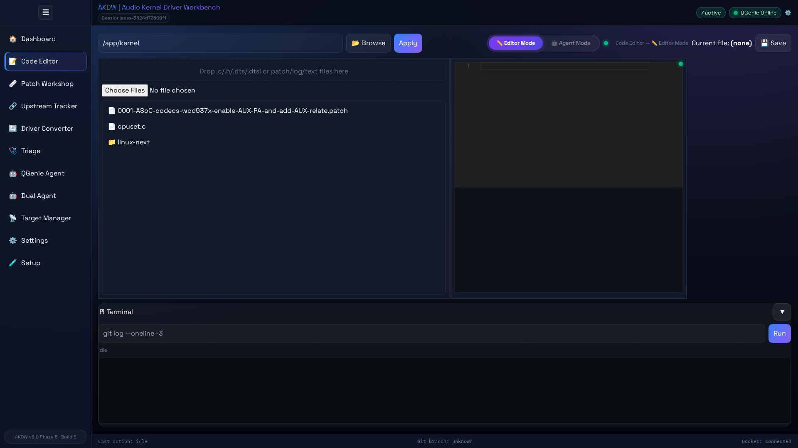
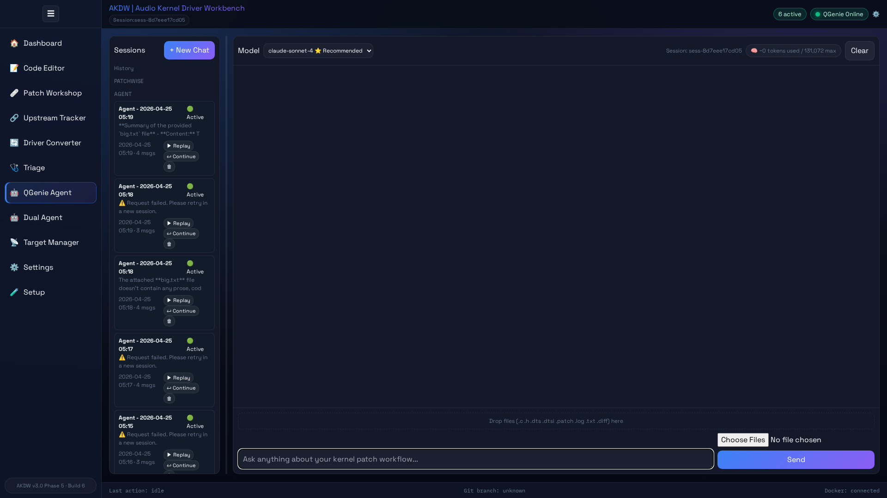
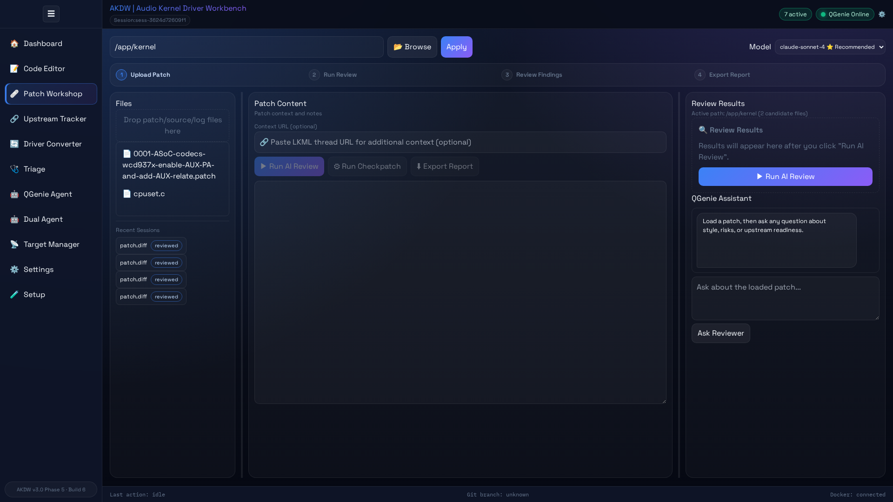
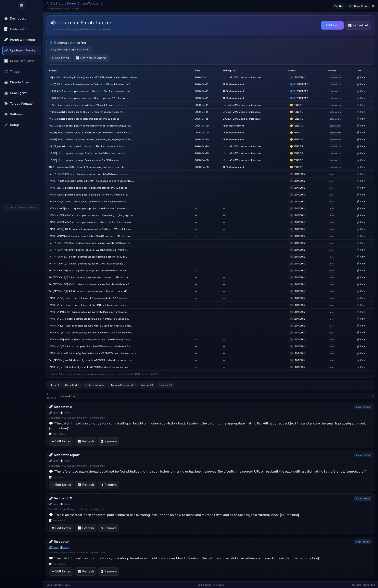
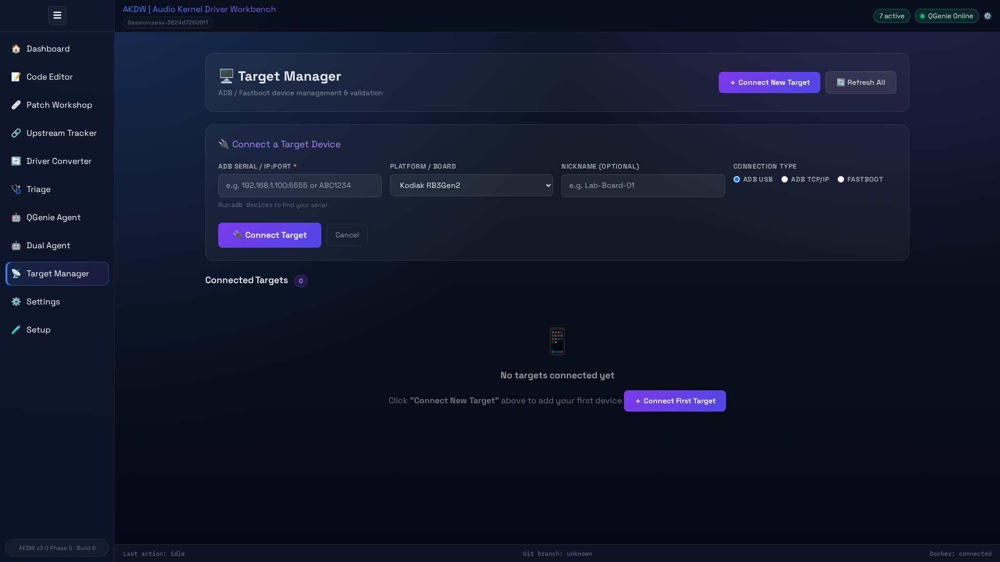
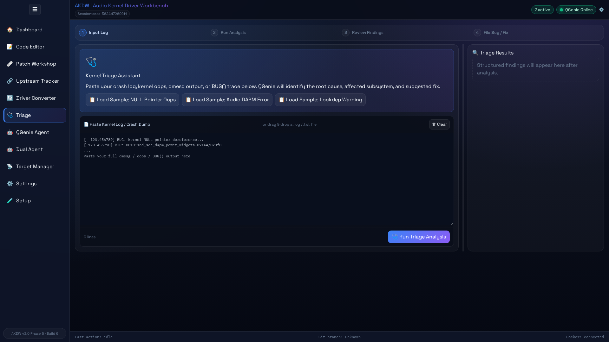
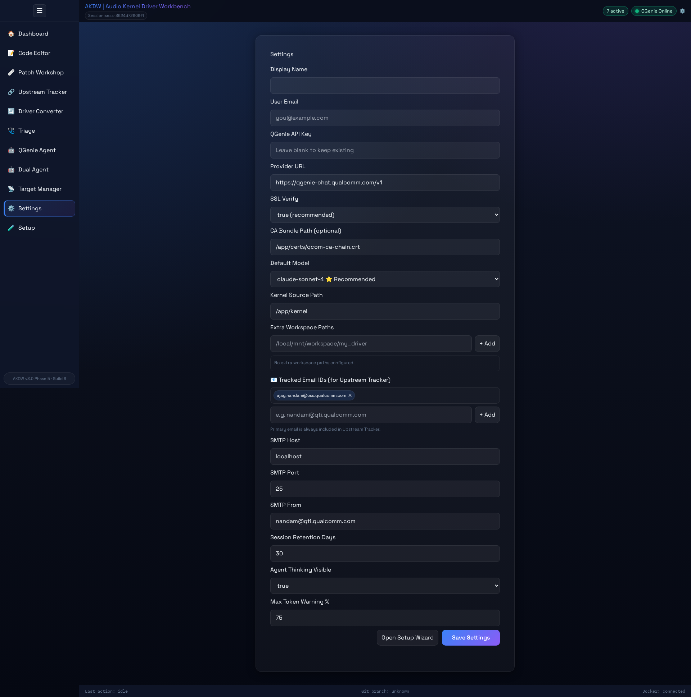

# AKDW Screenshot Gallery

Release-quality UI captures for AKDW modules.

Capture date: `2026-04-25`

## Recommended Screenshots

- `dashboard-glassmorphism-2026-04-25.png`
- `editor-terminal-ide-2026-04-25.png`
- `agent-thinking-stream-2026-04-25.png`
- `patchwise-guided-review-2026-04-25.png`
- `upstream-tracker-cards-2026-04-25.png`
- `target-manager-grid-terminal-2026-04-25.png`
- `triage-onboarding-2026-04-25.png`
- `settings-config-2026-04-25.png`

## Preview

### Dashboard



### Code Editor (Terminal-IDE)



### QGenie Agent



### Patch Workshop



### Upstream Tracker



### Target Manager



### Triage



### Settings



## Capture Guidance

- Resolution: 1920x1080 (desktop), plus one mobile-width capture where relevant.
- Theme: default glassmorphism tokens.
- Use realistic data (no secrets/API keys).
- Prefer UTC timestamp visibility where possible.

## Naming Convention

`<module>-<feature>-<yyyy-mm-dd>.png`

Examples:

- `agent-replay-2026-04-25.png`
- `editor-resizable-panels-2026-04-25.png`

## Optional README Embeds

```markdown


```
